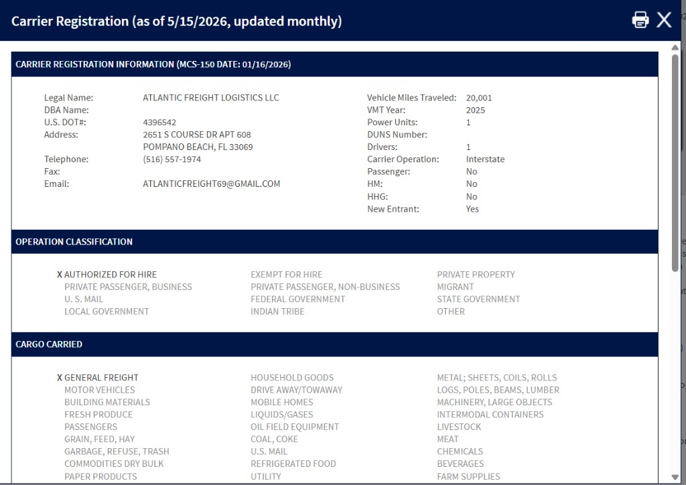

<div align="center">

# 🚀 Safer Carrier Extractor

**A Python Selenium automation tool for extracting carrier information from the FMCSA SAFER database, including legal names, addresses, phone numbers, and emails.**

Documented · MIT licensed · Maintained

[](https://www.python.org/)
[](LICENSE)
[](CONTRIBUTING.md)

</div>

---

## 🐍 Contribution graph

<picture>
  <source media="(prefers-color-scheme: dark)" srcset="https://raw.githubusercontent.com/mafzalkalwardev/safer-carrier-extractor/output/snake-dark.svg" />
  <source media="(prefers-color-scheme: light)" srcset="https://raw.githubusercontent.com/mafzalkalwardev/safer-carrier-extractor/output/snake.svg" />
  
</picture>

---

\# SAFER Carrier Extractor

A Python Selenium automation tool for extracting carrier data from the FMCSA SAFER database.

The tool automates MC searches and extracts:

\- legal names

\- addresses

\- phone numbers

\- emails

The extracted data is automatically stored into CSV files for dispatch workflows and carrier research.

\## Screenshots

## Screenshots



## Features

\- Automated FMCSA SAFER scraping

\- Carrier detail extraction

\- Email extraction

\- Address extraction

\- Telephone extraction

\- CSV export

\- Selenium automation

\- Edge WebDriver support

\- Automatic MC iteration

\- Graceful interruption handling

\## Tech Stack

\- Python

\- Selenium

\- Pandas

\- Edge WebDriver

\- CSV Processing

\## Project Structure

```text

safer-carrier-extractor/

│

├── SaferBot.py

├── template.csv

├── README.md

└── .gitignore

```

\## Installation

Install required packages:

```bash

pip install selenium pandas webdriver-manager

```

\## WebDriver Setup

Place:

```text

msedgedriver.exe

```

inside the project folder.

\## How to Run

```bash

python SaferBot.py

```

\## Features Overview

\### Automated Carrier Lookup

Automatically searches carrier MC numbers from FMCSA SAFER.

\### Carrier Data Extraction

Extracts:

\- legal name

\- address

\- telephone

\- email

\### CSV Export

Automatically saves extracted records into:

```text

records.csv

```

\### Interruption Support

Supports safe stopping and continuation.

\## Use Cases

\- Dispatch workflows

\- Carrier research

\- FMCSA data extraction

\- Logistics automation

\- Lead generation

\## Security Note

Do not upload:

\- private scraped datasets

\- sensitive carrier information

\- confidential records

\## Author

Muhammad Afzal Kalwar

GitHub:

@mafzalkalwardev
